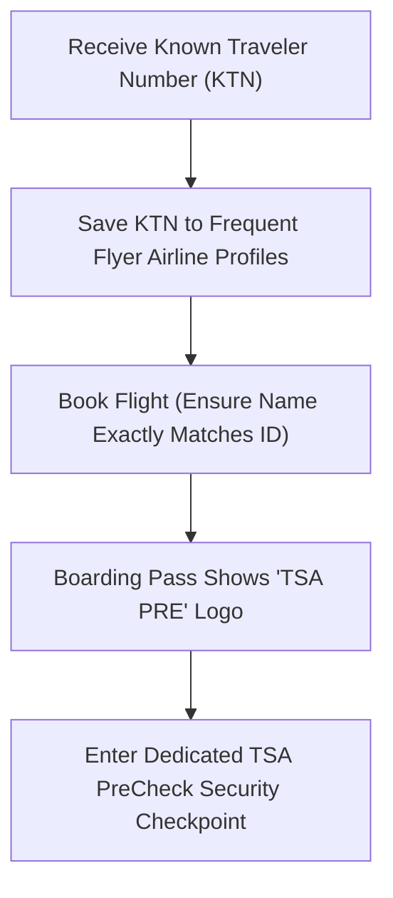

**TSA PreCheck** (often stylized as *TSA Pre✓®* or *TSA pre check*) is an expedited airport security screening program created by the U.S. Transportation Security Administration (TSA). It allows pre-screened, low-risk travelers to pass through designated security checkpoints at participating U.S. airports with significantly fewer restrictions and drastically shorter wait times.

If you have ever stood in a grueling airport line watching passengers in an adjacent lane walk through security with their shoes and jackets on while keeping their laptops in their bags, you were watching TSA PreCheck in action.

---

## TSA PreCheck at a Glance

| Feature | TSA PreCheck Summary |
|---|---|
| **What It Is** | Trusted traveler program providing expedited airport security screening |
| **Administered By** | Transportation Security Administration (TSA), U.S. Dept. of Homeland Security |
| **Cost** | $78 for new 5-year enrollment ($70 online renewal) |
| **Average Wait Time** | **< 10 minutes** for 99% of members |
| **Shoe Removal** | ❌ No — shoes stay on |
| **Electronics (Laptops/Tablets)** | ❌ No — stay inside your carry-on bag |
| **3-1-1 Liquids Bag** | ❌ No — remains packed inside your luggage |
| **Belts & Light Jackets** | ❌ No — keep them on through the metal detector |
| **Coverage** | 200+ U.S. airports, 85+ domestic and international airlines |
| **Validity** | 5 years |

---

## How TSA PreCheck Works: The Checkpoint Experience

The primary benefit of TSA PreCheck is an effortless, uninterrupted screening process. In a standard security line, travelers are required to perform a stressful series of disrobing and unpacking steps. TSA PreCheck eliminates nearly all of them.

```
Standard Security Lane                 TSA PreCheck Lane
──────────────────────                 ──────────────────
• Remove shoes & boots                 • Keep shoes on
• Pull out laptops/tablets             • Leave electronics in carry-on
• Extract 3-1-1 liquids bag            • Leave liquids packed inside
• Remove belt and outerwear jacket     • Keep light jacket & belt on
• Full-body millimeter-wave scanner    • Walk-through metal detector
• Average wait: 20–60 minutes          • Average wait: Under 10 minutes
```

### 1. Walk-Through Metal Detector vs. Full-Body Scanner
Instead of stepping into a cylindrical millimeter-wave imaging machine with your hands in the air, PreCheck passengers typically walk straight through a standard **walk-through metal detector**. This drastically speeds up passenger throughput from 150 passengers/hour to over 300 passengers/hour per lane.

### 2. No Liquids or Electronics Fumbling
Under standard [TSA 3-1-1 liquids rules](/guide/tsa-311-liquids-rule), all gels, liquids, and aerosols must be pulled out and placed in a bin, and all laptops or large tablets must be unpacked. In the TSA PreCheck lane, you simply place your roller bag and personal item directly onto the conveyor belt without unzipping anything.

### 3. Footwear and Outerwear Stay On
You do not have to walk barefoot or in socks across the airport floor. Tennis shoes, dress shoes, loafers, and sneakers stay on your feet. (Heavy steel-toe work boots or knee-high combat boots with excessive metal may still need to be screened if they trigger the detector).

---

## Who Is Eligible for TSA PreCheck?

TSA PreCheck is open to:
- **U.S. Citizens**
- **U.S. Lawful Permanent Residents (LPR / Green Card holders)**
- **U.S. Nationals**
- Foreign nationals holding membership in specific CBP Trusted Traveler programs (such as Global Entry, NEXUS, or SENTRI)

Applicants must pass a comprehensive background check and fingerprint biometric screening confirming no disqualifying criminal offenses or security violations.

---

## How Do You Use TSA PreCheck When Flying?

Enrolling in TSA PreCheck gives you a 9-digit **Known Traveler Number (KTN)**. To receive PreCheck benefits on your flight, follow this 3-step sequence:



1. **Add Your KTN to Your Airline Profile:** When booking tickets on Delta, United, American, Southwest, Alaska, JetBlue, or 80+ other carriers, enter your KTN in the "Known Traveler Number" field.
2. **Verify Your Boarding Pass:** When you check in 24 hours prior to departure, check your digital or printed boarding pass. It **must display the "TSA PRE✓" emblem** or text indicator.
3. **Head to the Dedicated Lane:** Follow airport overhead signage for *TSA Pre✓*. Present your boarding pass and government ID at the podium, and proceed through the expedited line.

> [!IMPORTANT]
> Simply showing your TSA PreCheck approval card or receipt at the checkpoint is not accepted. The "TSA PRE✓" indicator **must be embedded digitally on your boarding pass** at the time of check-in.

---

## Can Family Members and Children Go with You?

- **Children ages 12 and under:** Can accompany an enrolled parent or guardian through the TSA PreCheck lane for free without needing their own KTN.
- **Teens ages 13–17:** Can join an enrolled parent in the PreCheck lane **only if** the TSA PreCheck indicator appears on their boarding pass (which occurs automatically when traveling on the same reservation).
- **Adults (ages 18+):** Must each hold their own individual TSA PreCheck or Global Entry membership to enter the lane. Spouses or adult travel companions without PreCheck cannot accompany you.

---

## TSA PreCheck vs. Global Entry vs. CLEAR: What Is the Difference?

Travelers often confuse these three expedited airport security programs:

| Program | Best For | What It Expedites | Cost |
|---|---|---|---|
| **TSA PreCheck** | Domestic flights | Physical screening (shoes, laptops, bags) | $78 / 5 yrs |
| **[Global Entry](/guide/global-entry-vs-tsa-precheck)** | International & domestic flyers | U.S. Customs upon arrival + **Includes full TSA PreCheck** | $120 / 5 yrs |
| **CLEAR Plus** | High-volume business travelers | ID verification podium (skips the boarding pass queue) | $189 / 1 yr |

- **TSA PreCheck** speeds up the *physical X-ray and baggage screening*.
- **CLEAR Plus** is a private biometric service that speeds up the *identity verification line* before you reach the TSA screening area.
- **Global Entry** includes TSA PreCheck automatically and gives you automated passport control kiosks when entering the United States from abroad.

If you travel internationally even once a year, see our in-depth [Global Entry vs TSA PreCheck Comparison Guide](/guide/global-entry-vs-tsa-precheck) to see why Global Entry is usually the higher-value option.

---

## How to Get TSA PreCheck

Applying is straightforward and takes less than 20 minutes:

1. **Submit the Initial Application:** Complete the 5-minute online form at the official TSA portal ([tsa.gov/precheck](https://www.tsa.gov/precheck)).
2. **Schedule an In-Person Appointment:** Choose an authorized enrollment provider (**IDEMIA** or **Telos**) at an airport or retail center near you.
3. **Attend the 10-Minute Enrollment:** Bring your passport or government photo ID with a birth certificate, provide digital fingerprints, and pay the $78 fee.
4. **Receive Your KTN:** Most travelers receive their Known Traveler Number within **3 to 5 business days**.

For full instructions, fee reimbursement credit cards, and renewal procedures, read our complete [TSA PreCheck Application and Renewal Guide](/guide/tsa-precheck-guide).

---

## Frequently Asked Questions

### What does TSA PreCheck stand for?
TSA PreCheck stands for Transportation Security Administration Pre-Screened Checkpoint program. The "✓" symbol represents verified low-risk trusted traveler status.

### Is TSA PreCheck guaranteed on every flight?
While enrolled members receive PreCheck on over 95% of flights, TSA incorporates random, unannounced security measures. TSA reserves the right to randomly route any passenger to standard screening for security integrity.

### Does TSA PreCheck let you bring more liquids?
No. TSA PreCheck members are still bound by the [3-1-1 liquids rule](/guide/tsa-311-liquids-rule) (containers must be 3.4 oz / 100ml or smaller). The key difference is that PreCheck members **do not need to unpack the liquids bag from their luggage** at the checkpoint.

### How much time does TSA PreCheck save?
At major hub airports like Chicago O'Hare ([ORD](/guide/ord-tsa-wait-times)), Atlanta ([ATL](/guide/atl-tsa-wait-times)), and Miami ([MIA](/guide/mia-tsa-wait-times)), standard lines during peak morning hours can exceed 45 to 75 minutes. TSA PreCheck lanes average **under 10 minutes**, saving between 30 to 60 minutes per trip. Check current trends in our [TSA Wait Times Guide](/guide/tsa-wait-times-guide).

---

## Conclusion

TSA PreCheck is the single highest-return travel investment for domestic flyers in the United States. For just $78 over five years, it eliminates the friction of removing shoes, unpacking laptops, and fumbling with liquids—saving hours in security lines across 200+ airports nationwide.

---

## Related Guides & Official Resources

- [TSA PreCheck: Complete Cost, Application & Renewal Guide](/guide/tsa-precheck-guide)
- [Global Entry vs TSA PreCheck: Side-by-Side Comparison](/guide/global-entry-vs-tsa-precheck)
- [TSA Wait Times at Major US Airports](/guide/tsa-wait-times-guide)
- [TSA 3-1-1 Liquids Rule Explained](/guide/tsa-311-liquids-rule)
- [Can You Bring a Carry-On and a Personal Item?](/guide/carry-on-and-personal-item)
- [Official TSA PreCheck Portal](https://www.tsa.gov/precheck)
